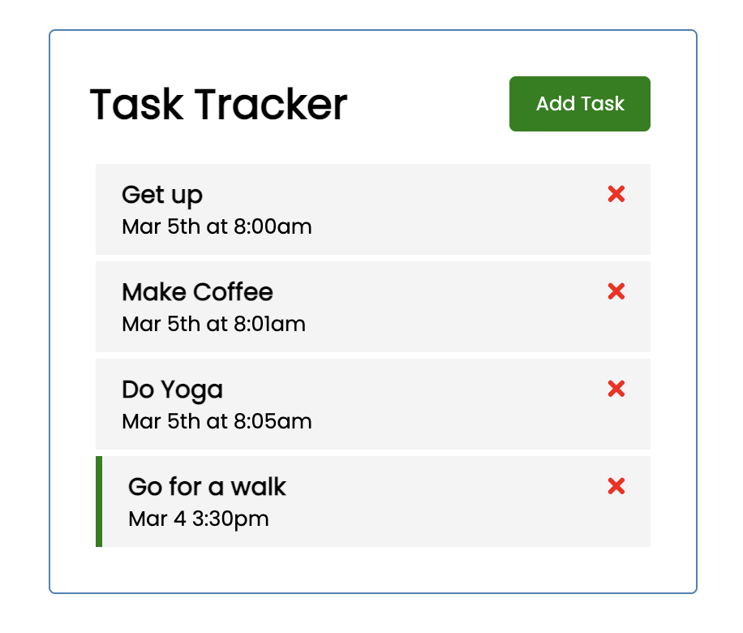
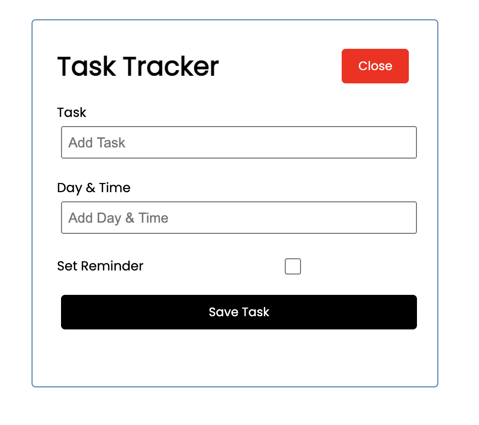

# Task Tracker
This is practice project using Vue3, running through Traversy Media's [tutorial](https://www.youtube.com/watch?v=qZXt1Aom3Cs&t=5413s).

* User clicks green 'Add Task' button, opening a form. Add task name and date. If set a reminder, a green border shows on the left of the task. The name is required. 

* User clicks the red 'close' to hide the form.

* User can del the task by clicking the red x.

* User can toggle the set a reminder by double clicking anywhere on the task.






Some initail tasks are seeded.

It is the same project I just built in react, and I plan to add a back-end to it.

## Project setup
```
yarn install
```

### Compiles and hot-reloads for development
```
yarn serve
```

### Compiles and minifies for production
```
yarn build
```

### Lints and fixes files
```
yarn lint
```

### Customize configuration
See [Configuration Reference](https://cli.vuejs.org/config/).
